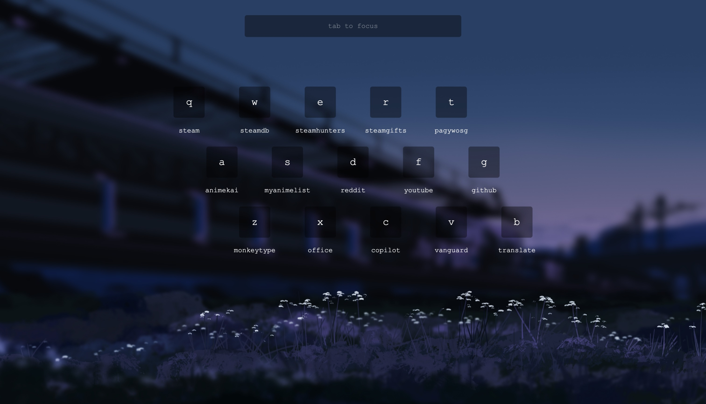

<div align="center">

# Nullium

***A personal startpage designed to keep your bookmarks accessible and in one place.***

</div>



## Demo
**Live Demo:** https://shauv.github.io/startpage

*Explore the interface, try the search, and play with the widgets.*

## Features
- **Time and Date:** Displays your device's local time and date.
- **Search Bar:** Search the web using your preferred search engine, or instantly launch bookmarks.
- **Tetris Minigame:** Play the retro game right on your startpage.
- **Virtual Buddy:** Interact with 'Null', your virtual companion.
- **Customization:** Change the search engine, bookmarks, colors, and wallpaper via `config.js`.

## Usage
1. Clone or download this repository.
2. Open `config.js` to customize bookmarks, search engine, colors, and wallpaper.
3. Open `index.html` in your browser.
4. Set `index.html` as your home page using the `file:///` path in your browser settings

> **Caution:** Most browsers do not allow local files as the "new tab" page without an extension.

## Configuration
- **Search Engine:** Choose from Google, Bing, Yahoo, Brave, DuckDuckGo, Startpage, Qwant, or Ecosia.
- **Bookmarks:** Organize your bookmarks into columns and set custom colors.
- **Wallpaper:** Set a custom wallpaper by providing an image URL.
- **Colors:** Adjust container and accent colors for your theme.
- **Fun:** Enable/disable Tetris and Null.

*All configuration options are found in `config.js`*

### Search Engine
Choose your search engine by setting the `engine` property to one of the `available` keys:

```javascript
searchEngines: {
    available: {
        google:      "https://www.google.com/search?q={query}",
        bing:        "https://www.bing.com/search?q={query}",
        yahoo:       "https://search.yahoo.com/search?p={query}",
        brave:       "https://search.brave.com/search?q={query}",
        duckduckgo:  "https://duckduckgo.com/?q={query}",
        startpage:   "https://www.startpage.com/do/dsearch?query={query}",
        qwant:       "https://www.qwant.com/?q={query}",
        ecosia:      "https://www.ecosia.org/search?q={query}"
    },

    // Set your preferred search engine here
        engine: "google"
},
```
> **Tip:** You can also use your own search engine by adding it to `searchEngines`.

### Bookmarks
The `bookmarks` are grouped into `column` `x`. Each bookmark requires a `name`, `url`, and `color`:  

```javascript
bookmarks: [
    {
        column: "1", // First column
        items: [
            // Each bookmark: name, URL, and custom color
            { name: "GitHub", url: "https://github.com", color: "#420666" },
            { name: "YouTube", url: "https://youtube.com", color: "#B00B69" }
        ]
    },
]
```
> **Tip:** You can add as many bookmarks or columns as you like. Just be sure your screen is big enough to accommodate them.

### Wallpaper
Set a custom wallpaper by providing an image `URL` or a local `path` in the `wallpaper` property:

```javascript
wallpaper: "https://w.wallhaven.cc/full/rd/wallhaven-rd989q.jpg",
```
> **Tip:** You can leave `wallpaper` empty to enable the default wallpaper.

### Colors
The `colors` are grouped into `primary` and `secondary`. Each color requires a `HEX` or `rgb` value: 
```javascript
colors: {
    // For containers and widgets
    primary: "rgba(0, 0, 0, 0.4)",

    // For text, borders, time, and labels
    secondary: "rgba(255, 255, 255, 1)",
},
```
> **Tip:** You can also use `rgba` to specify an alpha value for `opacity`.  
*Example: `rgba(r, g, b, 0.4)` for 0.4 opacity.*

### Fun
Enable or disable the `tetris` minigame and `null` virtual buddy widget:
```javascript
fun: {
    tetris: false, // Tetris widget is disabled
    null: true    // Null widget is enabled
},
```