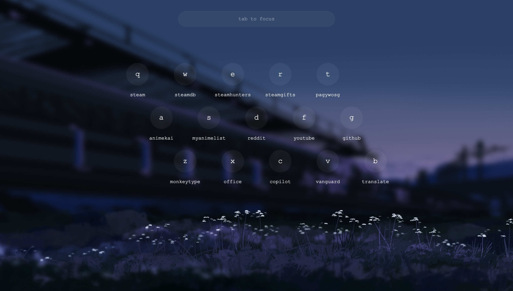
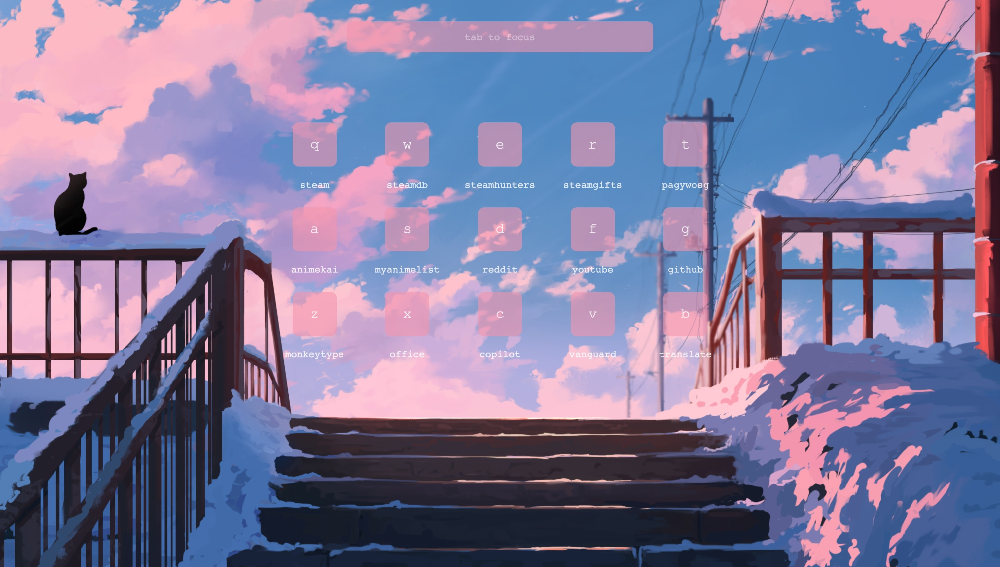
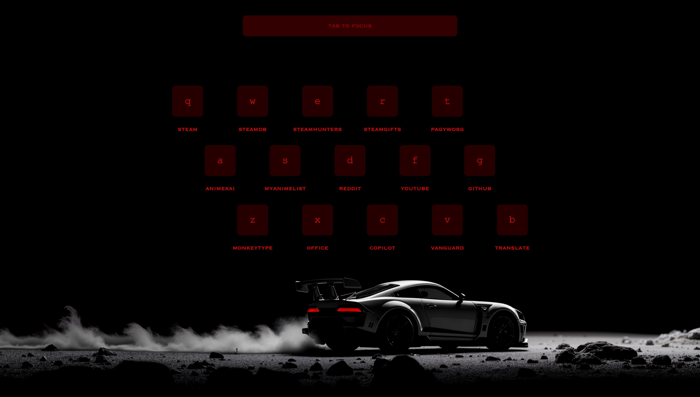

<div align="center">

# LeftLaunch

***An ergonomic startpage to quickly launch your bookmarks.***

</div>



## Demo
**Live Demo:** https://shauv.github.io/leftlaunch

## Features
- **Quick Launch:** Instantly launch bookmarks with a single keypress.
- **Bookmark Filtering:** Filter matching text using the navbar (tab to focus).
- **Keyboard Navigation:** All elements are interactable using only left-hand keys.
- **Configuration:** Configure the bookmarks, keymap and styling.

*Navbar launch priority: exact match > key match > prefix match > substring match > bookmark order.*

## Usage
1. Fork or download this repository.
2. Edit `config.js` to configure the bookmarks, keymap and styling.
3. Open `index.html` in your browser.
4. Set `index.html` as your home page using the `file:///` path.

*To use as a start page instead, an extension workaround would be required for most browsers.*

## Configuration
- **Bookmarks:** Add your bookmarks into the provided rows.
- **Keymap:** Choose from a selected preset of keymaps.
- **Styling:** Personalize your wallpaper, colors, fonts and other properties.

*All configuration options are found in `config.js`.*

### Bookmarks
The `bookmarks` are organised into 3 groups of 5. Each bookmark requires a `name` and `url`:  

```javascript
// Bookmark example
{ name: "youtube", url: "https://www.youtube.com/feed/subscriptions" },
```
> **Caution:** Ensure the number of bookmarks remains the same (15 bookmarks in total).

### Keymaps
There are 5 keymap `preset` values to choose from: `QWERTY`, `QWERTZ`, `AZERTY`, `Colemak`, `Dvorak` and an additional `Custom` value. If `preset` is set to `Custom`, the keys specified in `customKeys` are used:
```javascript
// Custom keymap example
preset: "Custom",
customKeys: ["A", "B", "C", "D", "E", "F", "G", "H", "I", "J", "K", "L", "M", "N", "O"],
```
> **Tip:** Set `case` to either `uppercase` or `lowercase`. Set `staggered` to either `true` or `false`.
### Styling - Wallpaper
Set a custom wallpaper by providing an image `URL` or a local `path` in the `wallpaper` property:

```javascript
// Wallpaper example
source: "https://w.wallhaven.cc/full/rd/wallhaven-rd989q.jpg",
```
> **Tip:** Providing a local path to your wallpaper source instead will allow for offline use.

### Styling - Elements
Styling properties for the `text`, `bookmarks`, `navbar` and `outline` can be adjusted. The `color` property requires a `HEX` or `rgb` value: 
```javascript
// Default bookmark color value
color: "rgba(0, 0, 0, 0.4)",
```
> **Tip:** You can also use `rgba` to specify an alpha value for `opacity`.  
*Example: `rgba(r, g, b, 0.4)` for 0.4 opacity.*

*Other styling properties include the text `size`, `fontFamily` and `placeholder`, the navbar and bookmarks `border_radius` and `blur`, and the outline `thickness` and `style`.*

## Screenshots


